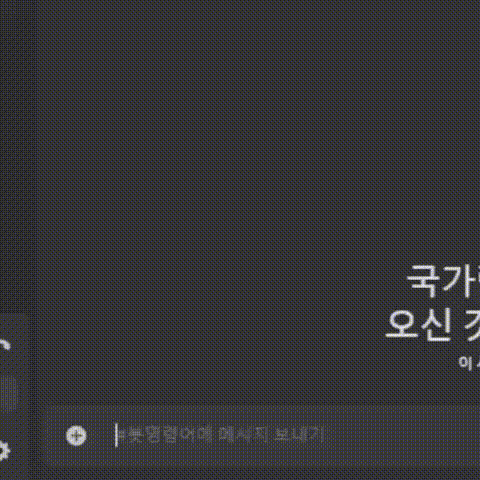

# MoeBot
  질문하면 대답해주는 디스코드 봇입니다. 
    
  음성채널 접속해있으면 일본어로 말도 해줌

  
    
## 사용법 
  BotConfig.cs 에 적을거 적으시고 한번 실행하신 다음에 bin\Debug\netX.X 밑에 ffmpeg, libsodium, opus 넣고 다시 실행하시면 됩니다.
    
  오디오 관련 파일인데 정확히 뭐하는 파일인지는 저도 모릅니다

  봇 실행하는 컴에 VoiceVox도 켜져있어야 합니다. 그냥 다운받아서 실행하면 알아서 로컬서버 실행 됩니다. 
    
  질문은 "!ask (님들이 하고싶은 질문)" 이렇게 하세요
  
## 사용 기술
  Discord.net 썼구요 Gemini api사용해서 질답처리 했습니다. 

  tts는 답변 받아온거(일본어 원문) VoiceVox에 던져서 오디오로 변환했습니다. 
    
  코드는 ChatGPT랑 Gemini가 합심해서 써줬습니다. 

## 
    
  프로그램에 문제가 많습니다. 일부 문제는 꼼수로 해결했습니다.
    
  감사합니다.
 
